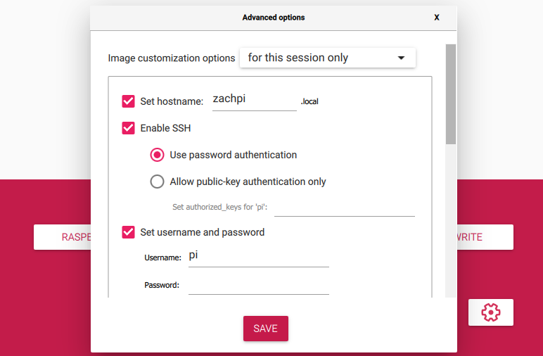

# Getting Up and Running With Kali Linux on Raspberry Pi
> Kali Linux is a Debian-based OS for digital forensics and penetration testing. It includes tools like Metasploit, Nmap, and Wireshark, supports multiple platforms, and is updated regularly.

## 0. Prerequisites
>In order to follow this documentation, you must have the following:
- 1x Raspberry Pi
- 1x microSD card
- [Raspberry Pi Imager](https://www.raspberrypi.com/software/) software 
- 1x computer or laptop with a microSD card slot/a compatible microSD adapter
- An internet connection

> If you meet the criteria you can move to the next steps!

## 1. Installation
> Installaing an operating system on the Raspberry Pi is strikingly easy, especially with the Raspberry Pi Imager - which we'll be using here.

**STEP 1**: Open **Raspberry Pi Imager**. You should be greeted with the following screen:

**STEP 2**: Select **CHOOSE OS**. A menu listing all available operating system categories will appear.

**STEP 3**: Navigate to **Other specific-purpose OS**, and choose **Kali Linux**.

**STEP 4**: Select the version corresponding to your version of Raspberry Pi. For me, I'll be using *Raspberry Pi 2 (v1.2), 3, 4 and 400 (64-bit)* as I am using a Raspberry Pi 3 Model B.

**STEP 5**: Select **CHOOSE STORAGE**.

**STEP 6**: Select the correct drive to flash with the operating system. 
> **THIS SHOULD APPEAR AS SOME TYPE OF USB/SD REMOVABLE DEVICE. TAKE CARE IN ENSURING THAT YOU DO NOT CHOOSE YOUR COMPUTER'S DRIVE, AS THIS WILL WIPE YOUR DATA COMPLETELY.**

**STEP 7**: Click on the gear icon. There are some basic settings which can be configured for your Raspberry Pi here. I will be enabling SSH, configuring a WiFI SSID and password, and setting a custom hostname for this example.

> **NOTE**: I will be using SSH to connect to the Pi later in the documentation. If you opt to not use SSH, this just means you will need to connect your Raspberry Pi to a monitor to access the terminal.

**STEP 8**: Once you are finished configuring the settings, choose **WRITE**, then **YES**.

**STEP 9**: The flashing process will begin. When it is complete, you can remove the microSD card from your computer, insert it into the Raspberry Pi, and plug it in.

>NOTE: When first booting, it may take some time for some services to start up, you may see messages like `Job runonce.service/start running (min s / no limit)`. It is normal for this to take some time.

## 2. Connecting via SSH

> NOTE: I cannot SSH using the hostname. I am able to SSH using the IP of the Raspberry Pi. So make sure you have a way of finding the given DHCP IP of your Pi when you need it.

**STEP 1**: Connect the Raspberry Pi to a monitor. This is to ensure that the Pi is connected to the WiFi.

**STEP 2**: Login to Kali. The default credentials are: USERNAME: `kali` PASSWORD: `kali`. Very secure! You should change these later.

**STEP 3**: Open the terminal. If you are prompted for a sudo password, use `kali` again.

**STEP 4**: Enter `sudo raspi-config`.

**STEP 5**: Navigate to **Network Options** using the arrow keys and select it with enter.

**STEP 6**: Choose **Wi-fi**, then **Ok**, then follow the instructiosn to enter the SSID and password of your network.

**STEP 7**: Choose **Finish**.

**STEP 8**: Type `ifconfig`.

**STEP 9**: Use the IP found there to SSH into the Raspberry Pi. For example, you can type `ssh ip_address_goes_here` into your Windows Command Prompt.

## 3. Overview of Kali Functionality
> The main appeal of Kali is the large toolkit of pre-installed programs designed for forensics and penetration testing. Explaining exactly how to use each and every progam is outside the scope of this tutorial, but I do recommend checking out this 96 part YouTube playlist by [David Bombal](https://www.youtube.com/playlist?list=PLhfrWIlLOoKMe1Ue0IdeULQvEgCgQ3a1B) to get started.

You can view the list of programs by hitting the Kali equivalent of the Windows button. This list includes programs for:
- Information gathering
- Vulnerability analysis
- Web App Analysis
- Database Assessment
- Password Attacks
- Wireless Attacks
- Reverse Engineering
- Exploitation Tools
- Sniffing and Spoofing
- Post Exploitation
- Forensics
- Reporting Tools
- Social Engineering Tools

